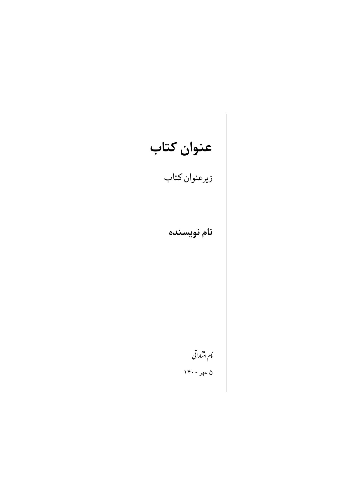
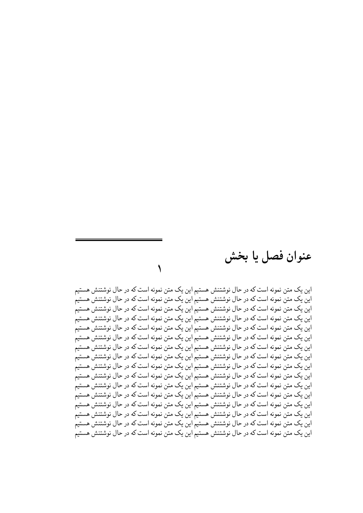
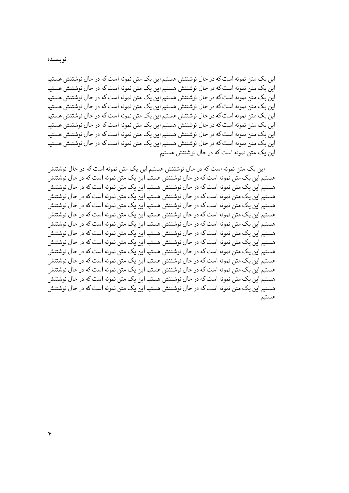

<h1>
قالب کتاب
</h1>

هربار کتاب یا رمانی می‌خوندم
همیشه کنجکاور می‌شدم که بدونم چطوری کتاب‌ها نوشته شده‌اند

تا اینکه شرایط جوری پیش رفت که من با لاتک آشنا بشم  
اون موقع فهمیدم که لزومی نداره برای نوشتن متن یا ساخت اسلاید از نرم‌افزار های آفیس استفاده بشه.
یکم که گذشت و بیشتر راجع به لاتک خوندم و یاد‌گرفتم، تضمیم گرفتم که یک قالب بنویسم و بصورت آزاد منتشر کنم.

البته اینم باید اضافه کنم، که تمام این قالب رو خودم ننوشتم. برگ مربوط به
<b>
نام کتاب و نویسنده
</b>
و طرح 
<b>
نمایش شروع هر فصل
</b>
کتاب رو از 
<a href="http://parsilatex.com/examples/">نمونه‌مثال‌های زی‌پرشین</a>
پیدا کردم و یک سری تغییرات توشون دادم

یک چیز دیگه‌ام باید اضافه بکنم، تصمیم گرفتم که هر فصل از کتاب رو داخل یک فایل جدا قرار بدم
تا فایل اصلی خیلی شلوغ و بی‌نظم نشه  
این یک تصمیم کاملا شخصی بوده و شما می‌تونین تمام متن تون رو داخل فایل index.tex
قرار بدین

